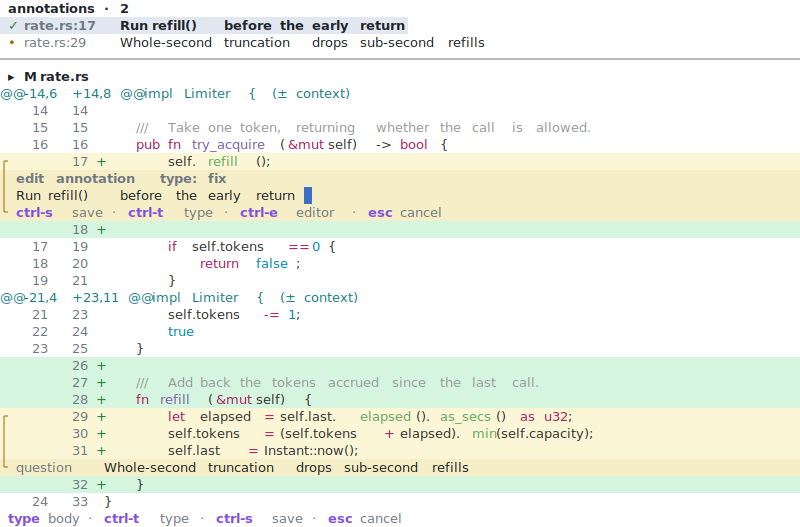

# margin

A local TUI for code-review annotations over git/jj.

Agentic development turns you into a reviewer, but the review loop is stuck in
chat. `margin` lets you step through a change in the terminal, pin comments to
lines or ranges, and hand them to a coding agent through a small CLI.

<picture>
  <source media="(prefers-color-scheme: dark)" srcset="docs/screenshot-dark.svg">
  
</picture>


## Usage

Run inside a repository:

```sh
margin                  # open the TUI; the band lists commits in <base>..@
margin --base develop   # set the base ref explicitly
margin -n 100           # with no base, list this many recent commits (default 50)
margin --theme dark     # force a theme; --vcs git|jj forces a backend
```

Select a commit, navigate files → hunks → lines, mark a line or range, and type
an annotation. Annotations persist in `.margin/annotations.ndjson`.

### Navigation

A top band sits above the full-width diff and shows one view at a time: the
commit list beside the selected commit's message, the changed-file list, or the
annotation overview. `Shift-Tab` cycles which view the band shows; `Tab` toggles
focus between the band and the diff. Moving through the file list scrolls the
diff to that file, and `Ctrl-u` / `Ctrl-d` scroll the commit message.

| Key | Action |
| --- | --- |
| `j` / `k`, `↓` / `↑` | move within the focused pane |
| `Tab` | toggle focus between the band and the diff |
| `Shift-Tab` | cycle the band view: commits → files → annotations |
| `Enter` | open the commit / jump to the file or annotation / annotate the line |
| `R` | reload revisions, diff, and annotations from disk |
| `q` | quit |

`R` reloads the state an agent wrote while margin stayed open (resolutions,
edits, new commits); the same reload also runs automatically as soon as the
annotation log changes on disk.

In the diff:

| Key | Action |
| --- | --- |
| `n` / `p` | next / previous change |
| `N` / `P` | next / previous annotation (crosses into adjacent commits) |
| `J` / `K` | next / previous commit |
| `Ctrl-d` / `Ctrl-u` | half-page down / up |
| `+` / `-` | expand / collapse context |
| `s` | toggle split / unified view |
| `v` (or `Space`) | start / stop a line-range selection |
| `a` | annotate the current line or selection |
| `Esc` / `h` | cancel / back to the band |

Annotations: `e` edit · `r` reopen · `d` delete · `u` undo · `t` timeline.

In the annotation editor:

| Key | Action |
| --- | --- |
| `←` / `→` · `↑` / `↓` | move the cursor by character / line |
| `Ctrl-←` / `Ctrl-→` | move the cursor by word |
| `Home` / `End` | jump to line start / end |
| `Del` · `Ctrl-w` | delete forward · delete the previous word |
| `Ctrl-e` | compose the annotation in `$EDITOR` (`$VISUAL`/`$EDITOR`, else `vi`) |
| `Ctrl-t` · `Ctrl-s` · `Esc` | cycle type · save · cancel |

`Ctrl-e` suspends the TUI and opens the body in your editor; the block above the
marker line quotes the annotated source lines and is ignored, so write below it
and save to apply.

Hand a review off to a coding agent without leaving margin: `c` launches a
headless `claude` on the focused annotation, `C` on every open annotation, and
`L` toggles a log panel that streams the session's activity below the diff. The status line
tracks progress; markers flip live as the agent records outcomes (see [Agent
handoff](#agent-handoff)). The session is non-blocking — keep navigating while
it runs.

The timeline (`t`) flags when the annotated change has moved under jj: `~`
amended/rebased, `!` divergent, `×` abandoned.

## Agent handoff

The CLI is the contract: the agent reads the review and writes back its
resolutions through it, never by parsing the store directly.

```sh
margin list --json                        # the review as machine-readable JSON (read)
margin list [--open]                      # same, one human-readable line per annotation
margin status <id> resolved [--reply ..]  # mark one addressed (write)
margin status <id> wont-do  [--reply ..]  # decline one
margin status <id> open     [--reason ..] # reopen for re-review
margin install-skill                      # install the agent skill into ~/.claude/skills/
```

`margin list --json` folds the event log into current per-annotation state
(status, re-anchored location, snippet), so the agent never touches the raw
NDJSON.

Under jj, each annotation also reports a `revision_state` — `unchanged`,
`amended`, `divergent`, or `abandoned` — tracking the annotated change across
amend/rebase via its change id; `amended` adds `current_commit`. The field is
omitted on git, which has no stable change identity across history edits, so its
presence signals jj change tracking is in effect.

The same handoff can be triggered from inside the TUI (`c` / `C`), which spawns
`claude -p … --output-format stream-json --permission-mode bypassPermissions` in
the repo and renders its streamed events. The session runs non-interactively —
it must edit files and run `margin status` without a prompt to answer — so it
acts on your working tree autonomously; review the result as you would any agent
run. It inherits the environment, so `CLAUDE_CONFIG_DIR` and `PATH` reach the
agent and it finds the installed skill; set `MARGIN_AGENT_CMD` to run a different
binary or a stub.

## Config

Optional `.margin/config.toml` at the repo root: `base` and `theme`, both
optional.

## Build

```sh
cargo build --release
cargo test
```

The screenshots above are generated from the headless renderer, so they stay in
sync with the UI:

```sh
cargo test dump_screenshot -- --ignored   # rewrites docs/screenshot-{dark,light}.svg
```

## License

[MIT](./LICENSE)
