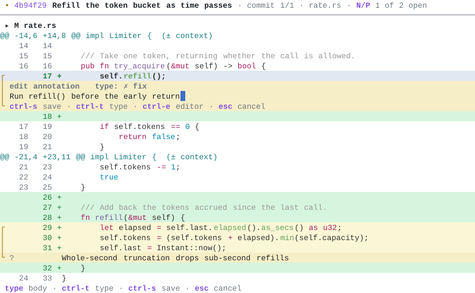

# margin

A local TUI for code-review annotations over git/jj.

Agentic development turns you into a reviewer, but the review loop is stuck in
chat. `margin` lets you step through a change in the terminal, pin comments to
lines or ranges, and hand them to a coding agent through a small CLI.

Most terminal review tools stop at an export you paste into a chat window.
`margin` keeps the review open, and the agent writes its answers back into it
through the CLI. Annotations follow the commit through the amend or rebase that
fixes them. The loop is laid out on
[margin.matze.lol](https://margin.matze.lol/).

<picture>
  <source media="(prefers-color-scheme: dark)" srcset="docs/screenshot-dark.svg">
  
</picture>


## Installation

**Pre-built binaries** are available on the [releases
page](https://github.com/matze/margin/releases) and can be placed anywhere on
`$PATH`. [binge](https://github.com/matze/binge) automates this:

```sh
binge install matze/margin
```

**Build from source** with an existing Rust toolchain:

```sh
cargo install --git https://github.com/matze/margin
```

## Usage

Run inside a repository:

```sh
margin                  # open the TUI on the commits in <base>..@
margin --base develop   # set the base ref explicitly
margin -n 100           # with no base, list this many recent commits (default 50)
margin --theme dark     # force a theme
margin --vcs git        # force a backend
```

Navigate the diff, mark a line or range, and type an annotation; `c` switches
commits. Annotations persist in `.margin/annotations.ndjson`.

Uncommitted work is reviewable too: under jj the working copy is the `@`
revision and is always listed; under git it appears as `(uncommitted changes)`
at the top of the list whenever tracked files differ from `HEAD`.

### Navigation

The diff owns the screen and always has the keyboard. Above it, a one-line
context header names the loaded commit, that commit's place in the review, the
file the cursor is in, and how many annotations are still open. Each counter
carries the key that steps through it — `J/K commit 2/7`, `N/P 3 of 5 open` —
so the motion is visible where its position is read.

The commit, file and annotation lists open as pickers over the diff, each on its
own key — there is no focus to toggle and no view to cycle. Moving a picker's
cursor previews the target in the diff behind it: `Enter` keeps that preview and
closes the picker, `Esc` discards it and puts the diff back where it was. A
list's own key toggles it, closing it on the preview like `Enter`; a different
list key switches lists without closing first.

| Key                   | Action                                            |
| --------------------- | --- |
| `c`                   | toggle the commit picker (`Ctrl-u` / `Ctrl-d` scroll the message beside it) |
| `f`                   | toggle the file picker |
| `A`                   | toggle the annotation overview |
| `j` / `k`, `↓` / `↑`  | move in the open picker, else in the diff |
| `Enter`               | keep the picker's preview / annotate the line |
| `Esc`                 | dismiss the picker / drop a line selection |
| `?`                   | show every binding; the help bar carries only the common ones. Any key closes it again |
| `H`                   | hand the review off: release every open annotation to a waiting agent |
| `R`                   | reload revisions, diff, and annotations from disk |
| `q`                   | close whatever is open over the diff, else quit |
| `Ctrl-c`              | quit from anywhere |

`q` only leaves margin from the bare diff: with a picker, the timeline, the key
reference or the agent log up, it closes that instead, so reaching for it cannot
end a review by accident. In the annotation editor it is plain text like any
other key.

`R` reloads the state an agent wrote while margin stayed open (resolutions,
edits, new commits); the same reload also runs automatically as soon as the
annotation log changes on disk.

In the diff:

| Key                   | Action                                                    |
| --------------------- | --------------------------------------------------------- |
| `n` / `p`             | next / previous change                                    |
| `N` / `P`             | next / previous annotation (crosses into adjacent commits)    |
| `J` / `K`             | next / previous commit                                    |
| `Ctrl-d` / `Ctrl-u`   | half-page down / up                                       |
| `+` / `-`             | expand / collapse context                                 |
| `s`                   | toggle split / unified view                               |
| `S`                   | show / collapse resolved annotations                      |
| `v` (or `Space`)      | start / stop a line-range selection                       |
| `a` (or `Enter`)      | annotate the current line or selection                    |
| `Esc`                 | drop the selection                                        |

An annotation the agent closed — resolved or declined — keeps only its gutter
icon (`✓`) on the lines it covers; its block stays out of the diff so the review
reads as what is left to do. `S` draws every closed annotation's block again (and
collapses them back). Collapsed or not, the keys below still act on the
annotation under the cursor, and the overview (`A`) lists it either way.

While hovering an annotation:

| Key                   | Action                        |
| --------------------- | ------------------------------|
| `e`                   | edit                          |
| `r`                   | reopen a closed annotation    |
| `d`                   | delete                        |
| `u`                   | undo earlier deletion         |
| `t`                   | toggle the timeline           |

In the annotation editor:

| Key                   | Action                                                    |
| --------------------- | --------------------------------------------------------- |
| `←` / `→`, `↑` / `↓`  | move the cursor by character / line                       |
| `Ctrl-←` / `Ctrl-→`   | move the cursor by word                                   |
| `Home` / `End`        | jump to line start / end                                  |
| `Del`, `Ctrl-w`       | delete forward, delete the previous word                  |
| `Ctrl-e`              | compose the annotation in `$VISUAL`/`$EDITOR`, else `vi`  |
| `Ctrl-t`              | cycle type                                                |
| `Ctrl-s`              | save                                                      |
| `Esc`                 | cancel and close editor                                   |

`Ctrl-e` suspends the TUI and opens the body in your editor. The block above the
marker line quotes the annotated source lines and is ignored, so write below it
and save to apply.

Hand a review off to a coding agent without leaving margin: `x` launches a
headless `claude` on the focused annotation, `X` on every open annotation, and
`L` toggles a log panel that streams the session's activity below the diff. The status line
tracks progress; markers flip live as the agent records outcomes (see [Agent
handoff](#agent-handoff)). The session is non-blocking — keep navigating while
it runs.

The timeline (`t`) flags when the annotated change has moved: `~` amended or
rebased, `!` divergent, `×` abandoned.

## Agent handoff

The CLI is the contract: the agent reads the review and writes back its
resolutions through it, never by parsing the store directly.

```sh
margin list --json                        # the review as machine-readable JSON (read)
margin list [--open]                      # same, one human-readable line per annotation
margin list --json --watch                # ... but wait for the review to be handed off first
margin status <id> resolved [--reply ..]  # mark one addressed (write)
margin status <id> wont-do  [--reply ..]  # decline one
margin status <id> open     [--reason ..] # reopen for re-review
margin install-skill                      # install the agent skill into ~/.claude/skills/
margin install-skill --dir <path>         # ... into another skills root
margin install-skill --print              # ... or to stdout, e.g. `>> AGENTS.md`
```

The skill only documents the CLI above, so any agent can follow it: `--print`
writes it wherever your agent looks for instructions.

`margin list --json` folds the event log into current per-annotation state
(status, re-anchored location, snippet), so the agent never touches the raw
NDJSON. Each annotation also carries its `history` — the replies and reopen
reasons recorded against it, oldest first — so a later run reads back what was
already tried and why you rejected it.

`--watch` blocks until you press `H` in the TUI, then prints and exits, so an
agent can be told "review this, I'll wait" once instead of polling for new
annotations and guessing when you are done.

Each annotation also reports a `revision_state` (`unchanged`, `amended`,
`divergent`, or `abandoned`) tracking the annotated commit across the rewrite
that fixes it; `amended` adds `current_commit`. The agent can therefore amend or
rebase what it reviewed and still be told which commit the annotation now sits
on.

jj derives this exactly, from the change id every rewrite preserves. git has no
such identity, so margin reconstructs it: a commit no longer reachable from any
ref is looked for among the last 1000 commits of all refs, matched on the author,
the author date and the subject — what amend, rebase and cherry-pick leave
alone. It follows the ordinary cases and degrades where git gives it nothing to
go on: a reworded or re-authored commit reads as `abandoned`, a commit copied to
two branches as `divergent`, and a rewrite older than the search window is not
found. The field is omitted entirely for annotations on git's working copy,
which is not a commit and leaves nothing behind to match.

The same handoff can be triggered from inside the TUI (`x` / `X`), which spawns
`claude -p … --output-format stream-json --permission-mode bypassPermissions` in
the repo and renders its streamed events. The session runs non-interactively
because it must edit files and run `margin status` without a prompt to answer.
Thus it acts on your working tree autonomously, review the result as you would
any agent run. It inherits the environment, so `CLAUDE_CONFIG_DIR` and `PATH`
reach the agent and it finds the installed skill; set `MARGIN_AGENT_CMD` to run
a different binary or a stub.

## Compared to other review TUIs

margin reviews the commits, or the working copy, that your agent is about to
rewrite, and it keeps that review as state in the repository. The tools below
solve neighbouring problems, and the table says where each of them wins.

- **[tuicr](https://github.com/agavra/tuicr)** — a full vim model, 23 themes,
  git/jj/hg, and `:submit` pushes a real inline review to GitHub or GitLab. Its
  agent path reads the human's comments as JSON and instructs the agent to poll
  every 30 seconds; nothing records that a comment was handled.
- **[hunk](https://github.com/modem-dev/hunk)** — a review-first diff viewer for
  agent-authored changesets, with git/jj/sapling, git pager and difftool
  integration, and a loopback daemon (`hunk session …`) an agent uses to drive
  the live window and add notes. Notes are scoped to the session, and there is
  no resolved/declined state on them.
- **[lumen](https://github.com/jnsahaj/lumen)** — a diff viewer plus AI commands
  (`draft`, `explain`, `operate`) and GitHub PR review. Annotations are
  ephemeral: `s` exits the TUI and prints them to stdout for the agent, which is
  where its loop ends.

| | margin | tuicr | hunk | lumen |
|---|:--:|:--:|:--:|:--:|
| Agent reports outcomes back into the review | ✅ | ❌ | ❌ | ❌ |
| Annotations survive amend/rebase of the reviewed commit | ✅ | ❌ | ❌ | ❌ |
| Annotations stored in the repository | ✅ | app-data dir | session | session |
| Append-only history, undo, per-annotation timeline | ✅ | ❌ | ❌ | ❌ |
| Review stays open, agent updates land in it live | ✅ | ❌ | ✅ | ❌ |
| Agent launched from inside the review | ✅ | via tmux | ❌ | ❌ |
| Push an inline review to GitHub / GitLab | ❌ | ✅ | ❌ | ❌ |
| Review someone else's PR / MR | ❌ | ✅ | ❌ | GitHub |
| AI commit messages, explanations, git command generation | ❌ | ❌ | ❌ | ✅ |
| Backends | git, jj | git, jj, hg | git, jj, sapling | git, jj |
| Vim model, mouse, theme gallery | minimal | extensive | mouse, themes | mouse, themes |

### Non-goals

Out of scope on purpose, and better served by the tools above: pushing an inline
review to a forge, reviewing someone else's pull request, mercurial support, a
full vim modality, a theme gallery, and a stable library API. Conceding that
breadth is what keeps the loop small enough to stay correct. If you want a
pull-request client, tuicr is the better tool.

## Build

```sh
cargo build --release
cargo test
```

The screenshots above are generated from the headless renderer, so they stay in
sync with the UI:

```sh
cargo test dump_screenshot -- --ignored   # rewrites docs/screenshot-{dark,light}.svg
```

## License

[MIT](./LICENSE)
